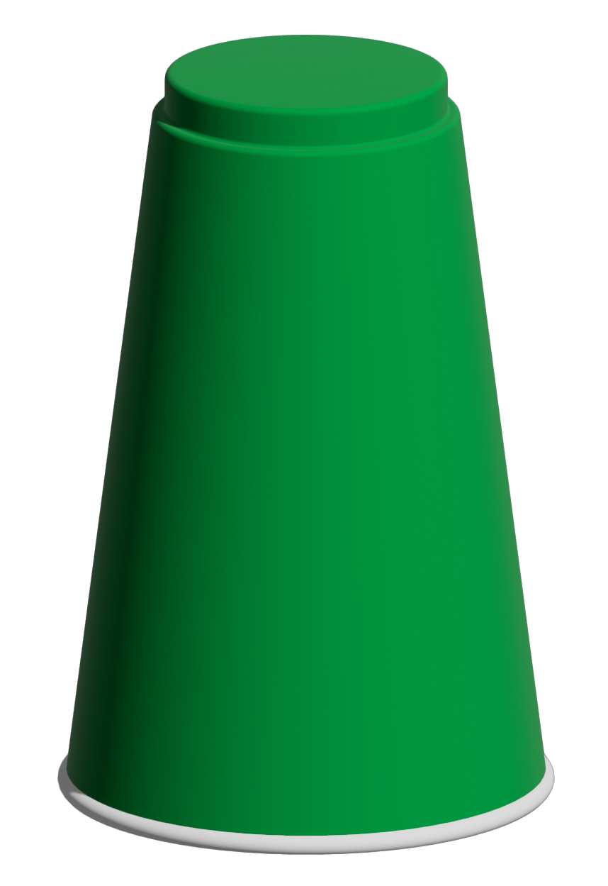

```{r}
#| label: loadPackagesData
library(ggplot2)
data(diamonds)

```

This is a sandbox document for us to practice different aspects of Quarto. For example, @fig-priceHistogram shows the histogram of diamonds prices (cite diamonds here) [@wickham_dataset:_2019].

```{r}
#| label: fig-priceHistogram
#| fig-cap: "Histogram of Diamond Prices"
#| fig-alt: "A positively skewed histogram of diamond prices going from 0 U S D to over 17500 U S D."
#| fig-pos: "H"
#| fig-width: 5

# Make a histogram of diamond price ----

ggplot(
  data = diamonds,
  mapping = aes(x = price)
) +
  geom_histogram(
    fill = "skyblue",
    color = "darkgrey",
    binwidth = 500,
    boundary = 0,
    closed = "left"
  ) +
  scale_y_continuous(
    expand = expansion(mult = c(0, 0.05))
  ) +
  theme_bw()

```

We created @fig-priceHistogram using the tools from the `{ggplot2}` package (citation here)[@ggplot2].

@fig-greenCup is a static image example.  

{#fig-greenCup fig-alt="Green cup flipped upside down." height="100pt"}



# References 
::: {#refs}
:::
